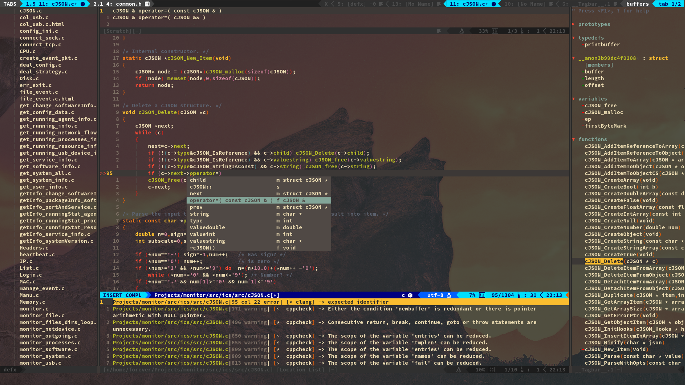
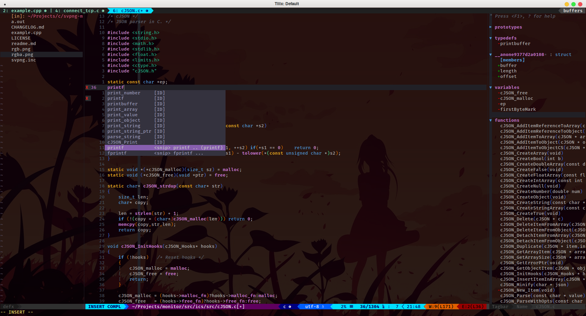
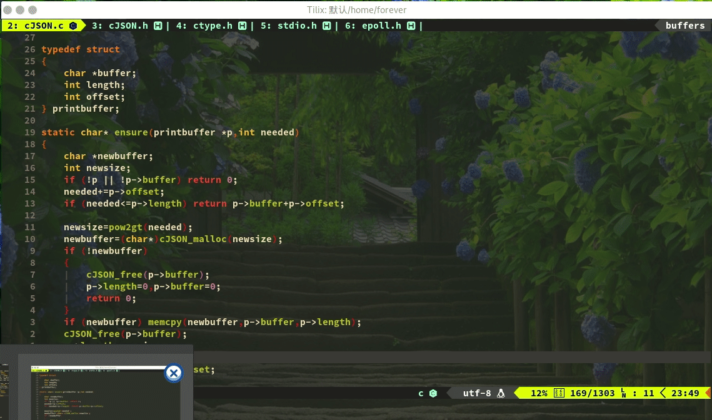
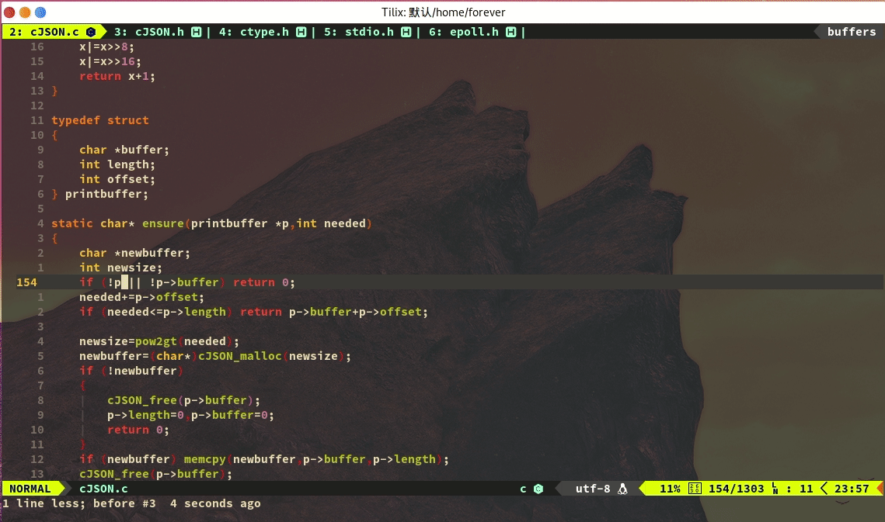
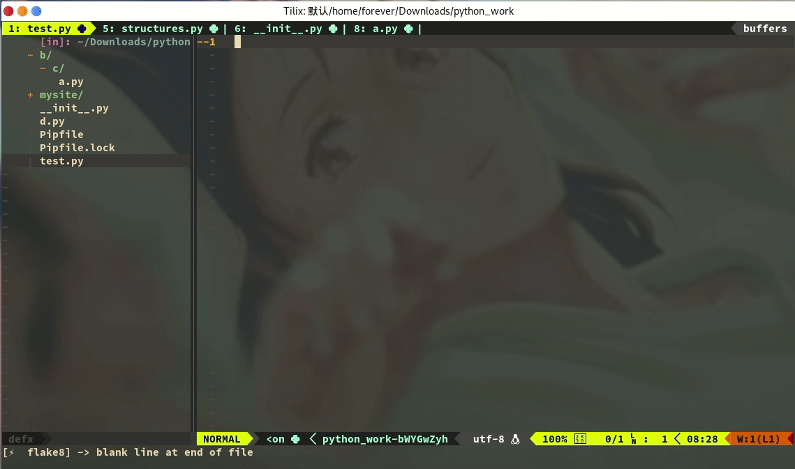

# vide

---

[TOC]

主要是记录下我的配置，方便查阅，同时也分享下我对这些插件的配置，你可以从中挑选一部分觉得适合自己的插件配置放到自己的配置中，我以后在开发过程中也会不断的尝试一些插件，欢迎star。

以前用vim，但是总感觉vim比neovim差点东西，而且以前的我喜欢大而全，将vim配置的特别豪华，各种语言都要支持，因此显得臃肿肥大速度也变慢了。另外，我在配置的时候也不管插件有没有冲突，一股脑往.vimrc中添加插件和配置，到最后.vimrc又臭又长，各种插件冲突快捷键冲突，导致最后的vim很难用了，借着这次重装系统的机会，我想尝试一下neovim，就不安装vim了，直接上neovim了。

这次我学聪明了，我将各个插件的配置从以前的一个配置文件中分离出来，每个插件都有自己的一个配置文件，这样既方便修改，也方便分享，别人觉得你的配置好直接把这个文件给他就好了，一目了然。

## 配置结构

首先这次的配置结构如下，当前的配置结构仅仅是我最初的设想，由于水平有限，我还没有实现我一个更好的设想，这个后期或许会考虑，先贴一下这次的总体结构，后面说一下我更好的设想。

```shell
# neovim的基础配置文件是~/.config/nvim/init.vim
.
├── autoload
│   └── plug.vim        # vim-plug插件
├── colors					# 用于存放主题的文件夹
├── config
│   ├── base.vim       # 基础配置
│   ├── keymap.vim  # 快捷键映射
│   ├── plugins           # 各种插件的配置文件夹
│   ├── plug.vim		# vim-plug的配置文件，用于描述需要哪些插件
│   └── theme.vim    # 主题配置
├── init.vim				# 初始配置
```

其中init.vim仅仅用于加载各种配置，主要的配置都在config文件夹下，其中该文件夹下面的base.vim用于基础配置，keymap用于配置各种快捷键映射，将这些快捷键集合在一起进行配置方便进行检索，theme.vim主要用于颜色主题的配置，plug.vim则是vim-plug这个插件的配置，主要描述需要哪些插件，plugins下面则是对应的各个插件的配置，每个插件的配置一个文件，该文件与插件同名。

以上便是最初设想的基本结构。

更高级的设想是这样子的，我能为不同语言的开发配置不同的插件，比如c语音的开发，我需要插件ycm，ale，autoformat，indentline；对于python语言的开发我需要ycm，ale，autoformat，indentline，python-repl等，我是不是可以根据语音或者工程的不同，提前打包好适合各个语音或工程的配置，启动该工程的时候仅仅启动这一撮相关的插件与配置就可以了呢？这样一些无关紧要的插件就不需要启动了，一些更适合该工程的插件可以替换原有的不合适的插件了，同时，再需要开发一种新的语言项目或者新的工程的时候可以只针对该工程进行相应的配置，而不影响其他的配置，最后，需要将一些通用插件分离出来，这些插件不管在哪个工程里都直接启动。

简单说就是不同的工程有不同的插件集合包，这样的优势还有统一工程目录，比如所有的工程都只需要在该工程下新建一个.vproject文件夹（或者其他名字），便表示包含该文件夹的目录便是该工程的根目录，那么一些需要根据工程需要进行配置的文件都丢在这个文件夹下面就好了，所有的插件都应该来搜索这个文件夹，然后去里面搜索自己所需的配置。

不知这样子会不会更好，依照我目前的水平，我还搞不定。

## 主界面截图






## 特性介绍

写代码无非就需要如下三个主要功能，代码补全跳转，代码检查，代码格式化。当然还有其他的辅助功能比如颜色，一键运行，注释等等等，这些都是辅助功能了。我们需要先把补全，检查，格式化配置好，这其中补全用到了两个插件，ycm和deoplete，他会根据文件类型自动开启关闭。对于c，c++，python，js，go，java语言自动启动ycm补全，对于其他文件则启动deoplete补全。代码检查使用了异步检查工具ale，代码格式化使用了格式化工具autoformat。其他一些插件参看[plug.vim](config/plug.vim)。

该配置对于c，c++，python，js补全相当nice，代码检查也很棒，可以通过后面的gif来了解。对于java和go我还没有详细检测，因为目前还用不到，按照下面的过程，你可以了解怎么使用该配置来开发c，c++，python，js项目，后面我需要开发java或者go或者asm项目的时候我会再来补充的，后期还会补充late的使用。

## 安装

### 依赖

这个是指电脑本机需要安装的软件，后面我会想办法尽可能减少这些依赖软件，或者可以写个脚本自动安装，不过我需要告诉你安装了些什么。

1. cmake 用于编译ycm
2. clang 用于ycm的c类语义补全
3. ctags 用于tagbar
4. node 用于js补全
5. npm 用于js的包管理
6. jdk 用于java补全
7. cppcheck 用于ale的语法检查
8. pylint 用于python的语法检查
9. flake8 用于python的语法检查
10. eslint 用于js，ts的语法检查
11. astyle 用于c，cpp，java的代码格式话工具
12. autopep8 用于python 的代码格式化工具
13. js-beautiful 用于js（js也可以用eslint格式化代码，需要配置）, json的格式化
14. xclip或者xsel用于neovim使用系统剪切板
15. python-neovim 要想使用neovim，需要安装这个软件
16. pipenv或者virtualenv用于python的虚拟环境

### 字体？

安装nerd字体，来[这里](https://github.com/ryanoasis/nerd-fonts/releases/tag/v2.0.0)下载

安装带补丁的字体，执行下面的命令

```shell
git clone https://github.com/powerline/fonts.git
cd fonts
./install.sh
然后执行fc-cache -fv
```

~~或者来这里下载我的dotfile，里面包含了所需字体，主题等~~

### 安装

作为一个开发者，一般上述工具都会安装了。

对于neovim，安装完上述工具之后把该项目克隆到~/.config/nvim下面，然后进入neovim，执行:PlugInstall等待安装完成就ok了。

对于vim，将项目克隆到~/.vim下面，然后进入vim，执行:PlugInstall等待安装完成即可

## 插件

### 插件管理器

插件管理器使用vim-plug，对于新的neovim，可以直接运行下面的命令安装

```shell
curl -fLo ~/.config/nvim/autoload/plug.vim --create-dirs https://raw.githubusercontent.com/junegunn/vim-plug/master/plug.vim
```

这样，vim-plug就会安装在~/.config/nvim/autoload下面了，启动neovim的时候就能够自动启动vim-plug了，或者直接从我的dotfile中下载。

安装完成后需要定义自己的插件需要安装在哪里，打开文件config/plug.vim，其内容如下所示：

```viml
call plug#begin('~/.cache/plugins')

" 插件列表
Plug 'Valloric/YouCompleteMe',
    \ {
    \ 'do': './install --clang-completer --clangd-completer --go-completer --ts-completer --java-completer',
    \ }
    
Plug '.....'
.....

call plug#end()

```

在call plug#begin()的括号中填写路径，表示插件将要安装到哪里，之后是插件列表，Plug '.../...'，后面可以带参数比如：

```viml
Plug 'Valloric/YouCompleteMe',
    \ {
    \ 'do': './install --clang-completer --clangd-completer --go-completer --ts-completer --java-completer',
    \ 'for': ['h', 'c', 'hpp', 'cpp', 'python', 'javascript', 'ts', 'java', 'go' ],
    \ 'on': ['']
    \ }
```

其中do表示在使用PlugInstall之后该插件需要执行的动作，for表示该插件在neovim编辑这些文件的时候才会载入，on表示该插件在neovim执行这些命令的时候才会载入，具体可以参考我的配置

### 插件列表

可以直接打开[config/plug.vim](./config/plug.vim)来查看，这里面只描述了插件，没有其他配置，因此很清晰。

### 补全

补全主要使用ycm与deoplete（补全框架），如果只想使用ycm也可以，我觉得deoplete速度比较快（使用过程中没感觉差多少），但是ycm比较强大，我使用ycm用于c，c++，python，javascripy，java，go的补全，其他文件使用deoplete，因此需要为这两个插件设置黑白名单，对ycm设置白名单，该配置在config/plugins/YouCompleteMe.vim中：

```viml
let g:ycm_filetype_whitelist = {
            \ "c":1,
            \ 'h': 1,
            \ 'hpp': 1,
            \ "cpp":1,
            \ "python":1,
            \ "javascript.jsx":1,
            \ "java":1,
            \ "ts":1,
            \ "go":1,
            \ }
```

以后只有该类文件才开启ycm，其他文件不开启。

对于deoplete则需要进行相应的配置，遇到上述文件的时候不启动deoplete，该配置在config/plugins/deoplete.vim中：

```viml
autocmd FileType c,h,cpp,hpp,python,js,java,go,ts
       \ call deoplete#custom#buffer_option('auto_complete', v:false)
```

在打开上述文件的时候关闭deoplete开启ycm。

> 这便是当前结构的弊端
>
> 如果是我设想的那种更高级的结构，我们只需要为不同的文件配置不同插件包集合就好了，无需担心各个插件之间相互影响。

对于如何知道文件类型，你可以这样做，打开你的文件，然后`:echo &filetype`便可查看文件类型了。

### 代码检查

代码检查使用的是ale，我们来看下ale需要用到的工具，这个需要在自己的电脑上安装这些工具，我们通过配置来查看一下所需的工具，[配置文件](config/plugins/ale.vim):

```shell
let g:ale_linters = {
            \   '*': ['remove_trailing_lines', 'trim_whitespace'],
            \   'asm': ['gcc'],
            \   'nasm': ['nasm'],
            \   'c': ['cppcheck', 'clang'],
            \   'cpp': ['cppcheck', 'clang'],
            \   'cmake': ['cmake-format'],
            \   'python': ['pylint', 'flake8'],
            \   'cuda': ['nvcc'],
            \   'go': ['gofmt'],
            \   'java': ['javac'],
            \   'javascript': ['eslint'],
            \   'shell': ['shell -n flag'],
            \   'lua': ['luac'],
            \   'yaml': ['prettier'],
            \   'latex': ['alex'],
            \   'vue': ['eslint'],
            \ }
```

直接安装你所需要的就可以了，不需要的可以不安装，比如不开发lua，可以不安装luac，安装完成就ok了。

[支持列表](https://github.com/w0rp/ale/blob/master/supported-tools.md)这里可以看到ale所支持的语言。

### 代码格式化

代码格式化使用的是autoformat，我们也是通过配置文件来观察需要安装哪些工具，[配置文件](config/plugins/vim-autoformat.vim)：

```shell
" js-beautiful: js html css json xml
" astyle: c c++ java go js 
" autopep8: python
```

安装完以上插件就ok了

### 其他

其他插件

## 开发使用

对于不同的项目，我尽量搜寻最合适的插件与配置，开发不同的项目只需要载入不同的配置就好了。

### c/c++项目

1. 头文件的补全与跳转leader g

   

2. 声明与定义的跳转leader  g

   

3. 语义补全

   会自动补全，也可以使用ctrl space强制补全

   

   与qtcreator类似，不需要了解是不是指针，直接输入点"."便可以出来补全，或者使用ctrl space强制补全，选中后如果是指针ycm自动将点"."改为->。

c/c++项目的开发有两种方式

方式一

使用.ycm_extra_conf.py文件方式，要使用该方式，在编译ycm的时候必须要有--clang-completer参数，该参数既支持.ycm_extra_conf.py方式，也支持compile_commands.json凡是，而--clang-completer参数仅支持compile_commands.json方式，当然可以同时添加两者。

该方式需要以下步骤，在项目根目录下放一个文件.ycm_extra_conf.py，[我的.ycm_extra_conf.py](#)，在其中flags中添加所需的内容，例子如下：

```python
# .......other code

flags = [
    '-Wall',
    '-Wextra',
    '-Werror',
    '-Wno-long-long',
    '-Wno-variadic-macros',
    '-fexceptions',
    '-DNDEBUG',
    '-DUSE_CLANG_COMPLETER',
    '-DYCM_EXPORT=',
    '-x',
    'c',	# c语言便写c，c++语言编写c++
    '-I', '.', 	# 包含当前路径
    '-I', './include/', # 自定义头文件路径
    '-isystem', '/usr/include', # 这是我系统的头文件路径
    '-isystem', '/usr/include/c++/8.3.0', # 这是我系统的c++头文件路径
    '-I', '/usr/include',
    '-I', '/usr/include/c++/8.3.0',
]

# ......other code
```

注意-isystem后面跟的是系统的头文件路径，一般-isystem跟系统目录之后再使用-I跟同样的目录，如果你要开发opencv，qt等的项目，记得-I -isystem opencv或者qt的include文件夹路径即可。

方式二

使用compile_commands.json方式，该方式

或者使用compile_data.json方式，该方式需要根据makefle进行生成，我还不太会makefile，所以没成功过，如果能够成功，那么后面的代码检查工具也可以使用该方式进行代码检查了，两者可以统一了。

### cuda项目

在这里先占个坑。

### python项目

1. python的语义补全

   会自动补全，也可以使用ctrl space强制补全

   

2. python的跳转leader  g

要实现以上功能，其实也不需要做什么事情，打开python文件coding就行了。

我建议python工程都需要建立一个虚拟环境来开发，这样也方便移植，虚拟环境我使用的是pipenv，当然也可以使用virtualenv，开发python项目前需要做如下工作：

1. 新建立一个文件夹，在该文件夹下面建立一个.venv文件夹，之后安装的所有包都在这里，如果不建立这个文件夹，那么之后安装的所有包会在`~/.local/share/virtualenv/XXX`下面

2. 使用命令`pipenv --python python版本号（比如2.7 3 3.6等）`来初始化虚拟环境，该命令生成了Pipfile文件和Pipfile.lock文件，其中Pipfile文件用于描述该工程安装了哪些包，Pipfile.lock文件用于描述依赖，在使用`pipenv 

   有时候因为源的问题，安装包比较慢，因此我们在初始化之后可以更改Pipfie文件中的源，有以下源可供选择：

   ```shell
   阿里云：http://mirrors.aliyun.com/pypi/simple/ 
   豆瓣：http://pypi.douban.com/simple/ 
   清华大学：https://pypi.tuna.tsinghua.edu.cn/simple/ 
   中国科学技术大学：https://pypi.mirrors.ustc.edu.cn/simple/
   直接更改[[source]]下面的url即可
   ```

3. 两种开发方式：

   1. 进入虚拟环境（建议）

      在项目目录下通过命令`pipenv shell`进入虚拟环境。

      该开发方式不需要配置什么东西，可以直接在虚拟环境中开发，不过需要安装几个包，neovim和pylint，在虚拟环境中执行下面的命令:

      ```shell
      pip install neovim
      pip install pylint
      pip install autopep8
      ```

      其中neovim用于neovim的python环境，pylint用于ale的代码检查，autopep8用于代码格式化

      之后就可以愉快的开发了

   2. 不进入虚拟环境

      如果不进入虚拟环境，那么我们需要配置一下python解释器的路径，python的补全使用的也是ycm，因此需要在该工程目录下添加一个文件.ycm_extra_conf.py，该文件中添加如下内容：

      ```python
      def Settings( **kwargs ):
        return {
          'interpreter_path': '/path/to/virtual/environment/python',
          'sys_path': [
            '/path/to/some/third_party/package',
            '/path/to/another/third_party/package'
          ]
        }
      ```

      其中`/path/to/virtual/environment/python`是python解释器的路径，需要写你虚拟环境python解释器的路径，如果在项目下建立了.venv文件夹的话，python解释器一般会在该文件夹下面，可以自己找一下。如果没有新建.venv文件夹的话，解释器路径应该在`~/.local/share/virtualenv/XXX`下面。

      此外，`/path/to/some/third_party/package`是指我们需要的包的路径，需要什么包就将他的路径写在这里。

4. 完成上述工作就可以开工了。

### JavaScript项目

1. js语义补全，甚至可以自动导入包

   

2. js跳转leader g

   

js工程的开发需要经过如下步骤

1. 在工程目录下建立一个jsconfig.json的文件，或者tsconfig.json的文件，一个是对应js项目，一个对应ts项目。

2. 在该文件中加入以下内容，关于该文件的详细配置可以参考[jsconfig.json](https://code.visualstudio.com/docs/languages/jsconfig)：

   ```json
   {
       "compilerOptions": {
           "checkJs": true		// 可以诊断js
       }
       "compilerOptions": {
           "target": "es6"
       },
   	// exclude, 排除
   	// 如果觉得速度慢了，建议写排除，尤其node_modules
       "exclude": [
           "node_modules"
       ],
   	// include, 包含
   	// 默认包含当前目录下的所有文件包括子文件夹的文件
   	// 写上include之后只包含include中的文件
   	"include": [
           "src/**/*"
       ]
   }
   // include 和 exclude的路径配置都是相对于jsconfig.json文件的
   ```

   一些编译选项：

   | 选项                         | 描述                                                         |
   | ---------------------------- | ------------------------------------------------------------ |
   | noLib                        | 不包含默认库文件                                             |
   | target                       | 明确使用哪一个库文件，可选："es3", "es5", "es6", "es2015", "es2016", "es2017", "es2018", "esnext". |
   | checkjs                      | 开启js的类型检查                                             |
   | experimentalDecorators       | Enables experimental support for proposed ES decorators.     |
   | allowSyntheticDefaultImports | Allow default imports from modules with no default export. This does not affect code emit, just type checking. |
   | baseUrl                      | Base directory to resolve non-relative module names.         |
   | paths                        | Specify path mapping to be computed relative to baseUrl option. |

      可以使用webpack别名：

      ```json
      {
        "compilerOptions": {
          "baseUrl": ".",
          "paths": {
              // 别名：路径，使用的时候可以直接import 一些东西 from 别名/xxx
            "ClientApp/*": ["./ClientApp/*"]
          }
        }
      }
      
      // 然后在文件中
      import Something from 'ClientApp/foo'
      ```

3. 使用命令`npm init`初始化工程，该命令会生成package.json文件用于描述该工程所安装的插件。可以通过命令` npm install pkg--save`来安装所需要的包，该命令会自动将包以及依赖写入package.json文件。

4. 执行命令`eslint --init`，该命令用于ale的代码检查

5.  npm嫌慢的话可以配置一下`npm config set registry https://registry.npm.taobao.org`

6. ok！

### java项目

未详细使用

### go项目

未详细使用

### latex

未详细使用

### web

未详细使用

### markdown

还是用typora吧

### git

我不太熟悉git，等熟悉了再来配置一下

### 其他

其他使用deoplete

## 通用

### 代码片段

使用插件[SirVer/ultisnips](https://github.com/SirVer/ultisnips)与插件[honza/vim-snippets](https://github.com/honza/vim-snippets)，其中第一个插件是用于解析代码片段的，安装了他之后便可以将代码 片段的提示加入到ycm或者deoplete的提示框中，后一个插件是一些代码片段的集合，可以自己编辑一些代码片段。

在ycm或者deoplete的提示中，选中代码片段后直接回车便可以补全整个代码块，选中代码块之后可以使用方向键来跳转到下一个需要填写的地方。


### 代码注释

代码注释一般是使用[scrooloose/*nerdcommenter*](https://github.com/scrooloose/nerdcommenter)这个插件。

该插件有一个快捷键 leader c space（是c不是ctrl）， 这样子的，可以智能注释与反注释。我想将这个快捷键绑定到ctrl /上，但是没有成功，我就是这么绑定的`noremap <c-/> leader c<space>`，不知道为什么不可以。那还是用它自带的快捷键吧，leader c表示启动注释，然后后面在跟上相应的功能。

关于该插件的使用，首先要知道如何切换注释形式，leader a可以在// 与 /*  */之间进行切换。

```shell
leader c c 对选中区域进行注释，只能注释
leader c A 在一行最后注释，只能注释
leader c l 只能注释，不过注释对齐了
leader c b 只能注释，不过注释对齐了
leader c i 可以注释也可以取消注释，未对齐
leader c s 用这种方式进行注释
/*
 * coding...
 * coding...
 */
leader c m 用这种方法进行注释
/*coding....
  coding */
leader c u 撤销注释
```

我还是喜欢对齐的，leader l或者leader c b，然后撤销使用leader c u，有时候使用leader c s


### 文档注释

这个插件是一个函数注释生成插件，支持c c++ python。

不配置快捷键了，因为不是经常使用，只有在函数开头才用，所以直接用命令：Dox即可，

同时还有DoxAuthor来输入作者信息，一般在文件开头。

DoxLic来输入许可证信息，一般在文件开头。


### tagbar

快捷键：F3

需要安装ctags，原来想用leaderf代替来着，但是还是用回来了，呃～～

按下F3可以打开关闭tagbar，需要安装ctags。


### 文件管理器

快捷键：

1. F2快速打开或者关闭文件管理器
2. alt o快速打开当前文件所在的目录

之前一直使用[vimfiler](https://github.com/Shougo/vimfiler.vim)，但是这个插件需要安装unite，作者现在已经不维护这个插件了，他推荐使用[defx](https://github.com/Shougo/defx.nvim)，这个插件在neovim下不需要安装unite了，直接安装这一个插件就可以使用了。

### 快速检索

快捷键：

1. alt s：模糊搜索当前文件内容
2. alt S：模糊搜索所有buffer的内容
3. alt r：模糊搜索最近打开的文件
4. alt t：模糊搜索tag，标签，函数等
5. alt T：模糊搜索当前所有buffer的标签
6. alt b：模糊搜索打开的buffer
7. leader f：模糊搜索文件


### 快速包围

这个插件可以给单词围上一个符号或者更改包围某个单词的符号为另一个符号，或者更改html的标签，很酷吧。

如下是一些用法，可以用来参考。

```shell


在repeat插件的加持下，按点"."可以重复上次加括号减括号改括号等的操作。

### 窗口切换

快捷键：alt w

在打开好多个窗口之后我们希望能够快速定位到其中的一个窗口，[t9md/vim-*choosewin*](https://github.com/t9md/vim-choosewin)便是一个窗口切换插件，可以选择窗口也可以交换窗口，映射了一下快捷键，alt w变启动choosewindow，然后此时可以选择窗口，或者按下s，可以将当前窗口与目标窗口进行交换。

其实我更希望的是buffer与windows都能够通过neovim最新的悬浮窗口进行选择。


### 平滑翻屏

在使用ctrl f，ctrl b， ctrl d，ctrl u进行滑动的时候，neovim会直接翻一屏或者半屏，而插件[terryma/*vim*-*smooth*-*scroll*](https://github.com/terryma/vim-smooth-scroll)则可以在使用ctrl f/b/d/u翻屏时进行滚动


### 快速移动

快捷键：

1. alt h：行内快速移动（废弃）
2. alt j：快速移动到行
3. alt k：根据字母进行快速移动
4. alt l：行内快速移动（废弃）


### 二进制编辑工具

输入:Vinarise即可。


### 括号补全与跳出括号

括号补全使用的是auto-pairs插件，使用alt n跳出括号

### 去除空白

以前用的插件是[*vim*-trailing-*whitespace*](https://github.com/bronson/vim-trailing-whitespace)，这是一个很古老的插件了，现在改用[ntpeters/*vim*-better-*whitespace*](https://github.com/ntpeters/vim-better-whitespace)了，这个插件可以自定义空白的颜色，比如我定义为白色，然后可以设置保存的时候自动去除空白。

```shell
let g:better_whitespace_guicolor='white'
let g:strip_whitespace_on_save = 1
let g:strip_whitespace_confirm = 0
```


### 阅读

快捷键：

1. F10

阅读使用的插件是[junegunn/goyo.vim]()和[junegunn/limelight.vim]()

### 缩进

一个缩进指示插件，直接在init.vim中添加Plug 'Yggdroot/indentLine'然后执行PLugInstall安装就可以使用了，懒得详细配置了。还是稍微配置一下吧，不同的缩进符号不同。

```shell
let g:indentLine_enable = 1
let g:indentLine_char_list = ['|', '¦', '┆', '┊', '▏']
```


### 图标

[ryanoasis/vim-*devicons*](https://github.com/ryanoasis/vim-devicons)这个插件可以显示图标，但是必须安装这个字体[Nerd Fonts](https://github.com/ryanoasis/nerd-fonts)或者来[这里](https://github.com/ryanoasis/nerd-fonts/releases)找一下合适的release。

### 快捷键
